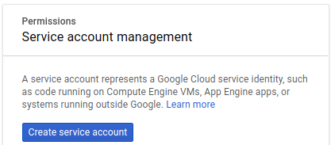
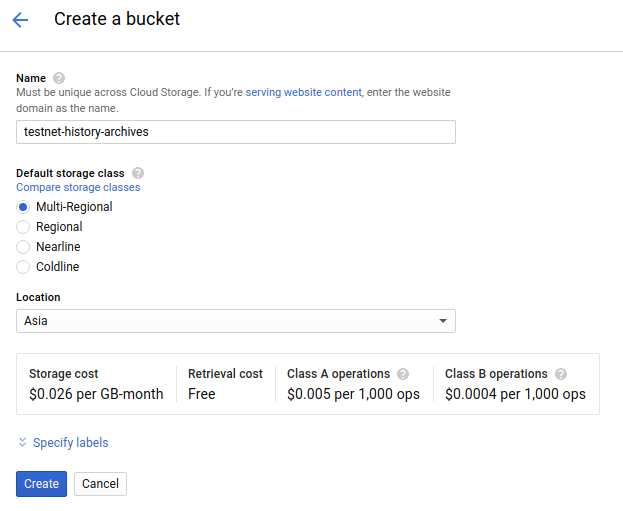
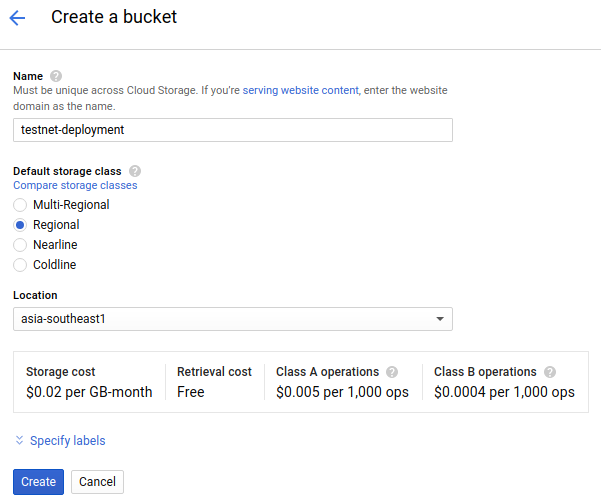

# Testnet

This is CLOUD DEPLOYMENT MANAGER template for create and running Stellar Core Validator 3 nodes. The configruation including installation local PostgreSQL database instance on each nodes.

Stellar-core and PostgreSQL are all running in the same GCE on differencr zone.

## Cost
The template creates a number of resources but the majority of them do not attract charges. You will be billed for the following resources:
* A GCE instance for every nodes.
* Cloud Storage capacity
*
Disclaimer: While we attempt to provide useful and up to date information, you are responsible for your own GCP account and the resources that you are charged for. Always be vigilant about doubling checking to ensure that the resources used are what your expect. 

## Template
The template .yaml and .jinja in the template foldes, so will be edit your parameter before running.

## Installation
Aside from having an Google Cloud account, You must create empty project first.

### 1. Create Service accounts with permission to access to Google Cloud Storage

Service account ID will be use as parameter for deploy instances in next step.

### 2. Create Cloud Storage bucket for history archive
Create bucket with storage class as "Multi-Regional"

### 3. Create Cloud Storage bucket for Deployment scripts
Create bucket with storage class as "Regional"

### 4. Add permission access to Cloud Storage bucket

Check Cloud Storage bucket already have allow Service accounts to access.

