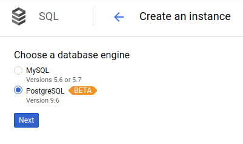
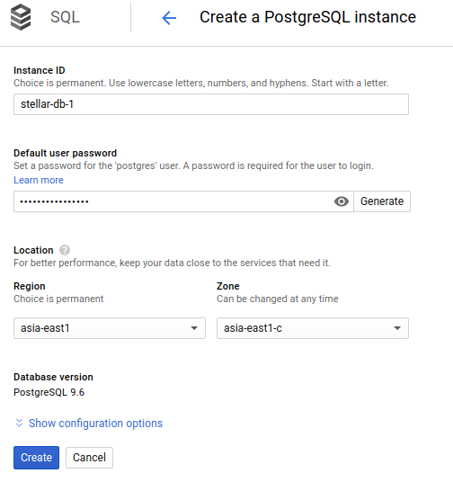
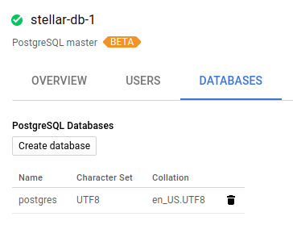
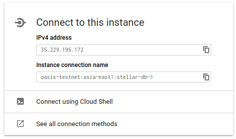

# Install Stellar Core and Horizon on Google Cloud

This is CLOUD DEPLOYMENT MANAGER template for create and running Stellar Core watcher that not required to participates in consensus and Stellar Horizon ingest mode in same node instance. The configuration including create Cloud SQL PostgreSQL database instance for high availability purpose.

Stellar-core and Stellar-horizon are all running in 1 GCE VM instance.

**Ref:**<br>
[Stellar Docs](https://www.stellar.org/developers/stellar-core/software/admin.html)<br>
[stellar-installation-packate](https://github.com/stellar/packages#sdf---packages)<br>

### Template
The template files is .yaml and .jinja in the template folders, you will be edit parameter before running.

---
### Prerequisites
* Existing Stellar Network with stellar-core.cfg and information for new stellar-core to connect to.
* A PostgreSQL database instances that have high availability features. You can create new database follow by this documents or skip the Cloud SQL installation if you already have PostgreSQL. 

# Begin Installation
#### 1. Create Google Cloud SQL instance






<br>
Click on Instance name and go to the detail page.


<br>
Click at USERS tab and "Create user account" button then insert username and password. Click CREATE to finish.

<br>
Click at DATABASES tab and "Create database" button then create "core" and "horizon" database.

<br>
Back to Inatance details page and click at "Connect using Cloud Shell".<br>
Cloud shell will display unix prompt and provide command line to connect to database. Press "Enter".<br>
Wait 2-3 seconds. It's ask password for connect to databases. Use password from database creation steps.

<br>
run command to grant your database user to have permission to create/insert/update/delete in core and horizon database.

```sql
postgres=> grant all privileges on database core to testnetadmin;
postgres=> grant all privileges on database horizon to testnetadmin;
```
You can replace database user "testnetadmin" to your desire username.<br>
Database username and password will be update to config.ini files in next steps.


---
